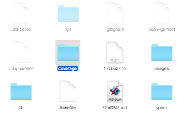
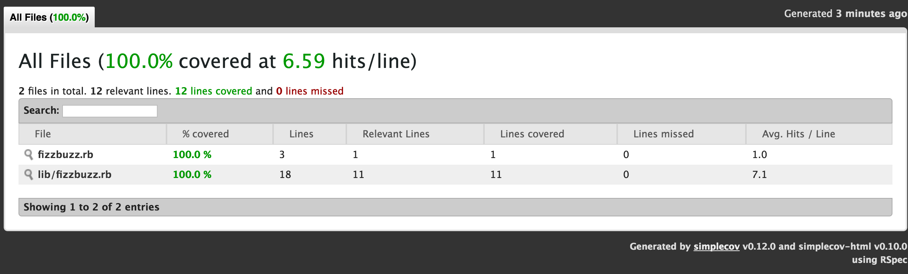

# Code Coverage
## Using Simplecov

Code Coverage is used to mean the degree to which your test suites test the source code of your program.  So a test suite has high-coverage if a large amount of the code in the program is executed in running the tests.  

## Simplecov
[Simplecov](https://github.com/colszowka/simplecov) is a a gem which will track which lines of code in your program are tested and give you an HTML report on your degree of code coverage.  

To get started you need to first install it.

```bash
gem 'simplecov'
```

Then we need to create a helper file which does all the common includes for our test and have our _spec.rb files require it.

```Ruby
# spec_helper.rb

require 'minitest'
require 'minitest/spec'
require 'minitest/autorun'
require 'minitest/reporters'
```

So you can take the above requires out of your spec files and then simply add the line:

```Ruby
require_relative 'spec_helper'
```

### To use Simplecov

To use Simplecov simply add the lines:

```Ruby
# spec_helper.rb
require 'simplecov'
SimpleCov.start
```

to the top of your spec helper file.  So the finished product should look like this:
```Ruby
require 'simplecov'
SimpleCov.start

require 'minitest'
require 'minitest/spec'
require 'minitest/autorun'
require 'minitest/reporters'

Minitest::Reporters.use! Minitest::Reporters::SpecReporter.new
```

Now when you run your ```rake test``` you will see a coverage folder provided which will tell you how well your program is **covered.**




